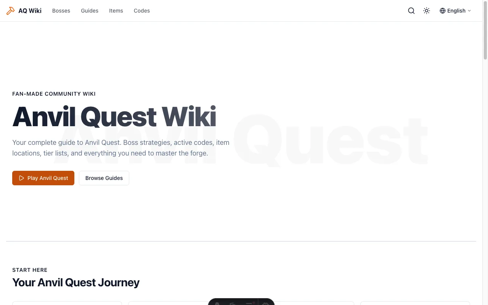

# AnvilWiki ⚒️

> 带 AI 内容工作流的游戏 wiki 模板——广告收入 100% 归你。
> 开源、Cloudflare Pages 原生优化、零成本免费部署上线。
>
> The game wiki template with an AI-native content workflow — 100% of your ad revenue.
> Open source, natively optimized for Cloudflare Pages, free to deploy.

**[📖 中文文档](#-中文文档) · [English Documentation](#-english-documentation)**

[](LICENSE)
[](https://astro.build)
[](https://pages.cloudflare.com)
[](https://github.com/ai-ashao/AnvilWiki/releases)
[](https://anvilwiki.pages.dev/)
[](https://anvilwiki.pages.dev/landing/docs)

[](https://anvilwiki.pages.dev/)

> Lighthouse 4×100 — 实测于 [anvilwiki.pages.dev](https://anvilwiki.pages.dev/)（2026-08-12）
> [](https://anvilwiki.pages.dev/)
> [](https://anvilwiki.pages.dev/)
> [](https://anvilwiki.pages.dev/)
> [](https://anvilwiki.pages.dev/)

---

## 🚀 快速链接

| 你想… | 去这里 |
|---|---|
| **零基础从零做一个赚钱的游戏站** | 📚 [学习手册(11 章)](https://anvilwiki.pages.dev/zh/landing/docs/learn)——每步写明「做什么/怎么做/你会看到什么」,含 18 个可复制提示词 |
| 看「从零到赚钱」的全部工作量 | 🗺️ [文档中心首页](https://anvilwiki.pages.dev/zh/landing/docs)——10 件事全景清单,逐项点入 |
| 深度定制 / 给模板写代码 | 🔧 [开发手册(7 章)](https://anvilwiki.pages.dev/zh/landing/docs/dev) |
| 看看做出来长什么样 | 🎮 [在线 Demo](https://anvilwiki.pages.dev/)——虚构游戏「Anvil Quest」的完整 wiki |
| 对比 Fandom / Wiki.js / 其他方案 | ⚖️ [完整对比页](https://anvilwiki.pages.dev/zh/landing/comparison)——三种物种、自托管引擎数据表、什么时候不该选 AnvilWiki |

## 📖 中文文档

### 这是什么？

AnvilWiki 是一个**游戏 SEO 内容站模板**——用来快速搭建围绕某款游戏(Roblox、Steam 新游等)的攻略内容站,通过 SEO 获取流量,通过广告变现。**广告收入 100% 归你**:无平台抽成、无收入分成(对比 Fandom 等托管 wiki 的平台分成模式)。

技术栈是 **Astro + Cloudflare Pages**:纯静态输出、零适配器、免费无限带宽、全球 CDN、零 JS 优先(首屏极快)。

**适合谁**:想靠游戏内容做副业、会用浏览器但**不会编程**的人(学习手册就是按这个标准写的),以及想被 AI 工作流加速的内容创作者。

### 核心特性

- 📚 **零基础双手册**:学习手册 11 章 + 开发手册 7 章,中英双语,从选游戏到赚到钱,每步 SOP + 18 个可复制 AI 提示词([站内阅读](https://anvilwiki.pages.dev/zh/landing/docs))
- 🤖 **AI 对话即产页**:内容技能随仓库分发(`.agent/skills/`),对 ZCode / Claude Code / Codex 说「根据这些笔记写篇攻略」,产出自动通过构建质检;批量产页走 **PR 门控管道**——AI 写、八道质量门禁验、你审完才合并([docs/content-pipeline.md](docs/content-pipeline.md))
- 🧭 **一套工具管 N 个站**:`anvilwiki-ops`(npx 免安装 + MCP)让 AI 替你拉 GSC/Cloudflare 数据、给优化清单,并追踪 ChatGPT/Perplexity 等 **AI 引用来路**([docs/multi-site.md](docs/multi-site.md))
- 🧰 **产能三件套**:`pnpm template-audit` 检查「这个站还能不能干净复制成下一个」、`pnpm bulk-new-posts` 从关键词清单批量铺内页草稿、`pnpm gen-covers` 自动生成 1200×675 封面(中日文标题自动配字体)
- 💰 **变现三件套**:AdSense 广告位 ×3 + 联盟链接组件 + 文末建议位,全部默认关闭、env/config 驱动,收入 100% 归你([docs/ads.md](docs/ads.md))
- 🔍 **SEO 工程化**:sitemap(含 lastmod)/ JSON-LD 全套 / hreflang / Quick Answer 摘要块 / llms.txt(AI 搜索),全部自动生成
- ⚡ **Lighthouse 4×100 开箱即得**:Astro 零 JS 优先,开了广告也不掉分
- 🆓 **零成本**:Cloudflare Pages 免费无限带宽 + 全球 CDN + SSL,永远没有服务器账单
- 🌍 **多语言开箱即用**:英文无前缀(SEO 最优),缺失内容自动回退英文,直链永不 404
- 🎮 **wiki 级呈现**:Boss 数据卡、兑换码一键复制、TOC 滚动高亮、画廊灯箱、Giscus 评论(默认关)

### 5 分钟快速开始

**开始前需要**:[Node.js 22+](https://nodejs.org) 和 pnpm(没装 pnpm?终端跑 `npm install -g pnpm`;或跟着[学习手册第 2 章](https://anvilwiki.pages.dev/zh/landing/docs/install-tools)把 6 样工具一次装齐)。

```bash
# 1. Fork 本仓库(仓库右上角 Fork 按钮),然后克隆你的 fork(换成你的 GitHub 用户名)
git clone https://github.com/<你的用户名>/AnvilWiki.git
cd AnvilWiki

# 2. 安装依赖并本地预览
pnpm install
pnpm dev            # 打开 http://localhost:4321,能看到 demo 站 = 环境通了

# 3. 一条问答式命令,把 demo 站换成你的游戏(游戏名/主题色/域名/语言…)
pnpm apply-template

# 4. 把改动推回你的 fork
git add .
git commit -m "Apply my game"
git push           # 第 5 步 Cloudflare 连的是 GitHub 远端仓库,不推上去它连到的还是 demo

# 5. 部署:cloudflare.com → Workers & Pages → Create → Pages → Connect to Git → 选你的 fork
#    构建命令 pnpm build、输出目录 dist 会自动识别;环境变量加 NODE_VERSION=22
```

> 💡 **本 Fork 默认由 Cloudflare Dashboard 管理环境变量**：部署时请在 Pages → Settings → **Environment variables** 配置 `SITE_URL`（必须含 `https://`）和 `NODE_VERSION=22`。如果以后自行添加 `wrangler.toml`，它会接管 Pages 环境变量；完整说明见 [docs/deployment.md](docs/deployment.md)。

**不想碰终端?有一条零命令路径**:fork 后打开你仓库的 **Actions** 页签 → 左侧选 **Initialize AnvilWiki** → **Run workflow**(填你的域名)→ 合并它开好的 PR → 做上面的第 5 步，并在 Cloudflare Dashboard 配好 `SITE_URL`。游戏名、主题色等之后随时可以让 AI 助手帮你改。

**完全新手?别从这里开始**——先去[学习手册](https://anvilwiki.pages.dev/zh/landing/docs/learn):第 1 章帮你选游戏,第 2 章把终端、Node、Git、AI 助手怎么装、每步会看到什么全部写清,第 3 章才建站。手册源码在 [`docs/handbook/`](docs/handbook/),fork 后依然保留(但站内文档中心页面会自动移除,属正常)。

准备首个真实站时，也可以直接按本 Fork 的[首个游戏站实验清单](docs/first-game-experiment.md)执行。

### 用 AI 直接生成内容(无需脚本)

fork 后用 ZCode / Claude Code / Codex / Cursor 打开仓库,直接对话即可产页。Agent 会自动加载仓库里的内容规范,生成后自动跑 `pnpm check-content && pnpm build` 自检。内置 4 个技能:

| 技能 | 用途 |
|---|---|
| `anvil-new-article` | 任意素材(口述/视频内容/原始数据)→ 合规 MDX 文章 |
| `anvil-batch-articles` | 关键词清单 → 批量生成一批内页(意图归类 → `bulk-new-posts` 脚手架 → 统一提示词填充) |
| `anvil-update-codes` | 新兑换码/过期码 → 更新 codes 页并同步多语言 |
| `anvil-refresh` | 新鲜度巡检 → 输出「该更新什么」优先级清单 |

完整的提示词库(选品分析、产页、批量产页、翻译、SEO 体检、关键词选题等 18 个模板)在[学习手册](https://anvilwiki.pages.dev/zh/landing/docs/learn)里,整段复制就能用。

### 文档在哪里?

| 入口 | 内容 |
|---|---|
| 📚 [站内文档中心](https://anvilwiki.pages.dev/zh/landing/docs) | **首选**:双手册 + 「从零到赚钱 10 件事」全景清单,中英双语 |
| 🗂️ [docs/README.md](docs/README.md) | 仓库内全部参考文档索引(选品/挖词/部署/SEO/广告/内容管道/多站运营…),按角色与时机分类,附四条阅读路径 |
| 📋 [requirements/](requirements/) | 建站前素材准备模板:事实来源表 + 对标参考表 |
| 🏗️ [docs/PRD.md](docs/PRD.md) | 架构唯一真相源:想知道「为什么这么设计」看这里 |

### 为什么不用 Fandom / 自建 Next.js?

| | AnvilWiki | Fandom 类平台 | 自建 Next.js |
| --- | --- | --- | --- |
| 广告收入 | **100% 归你**(自带 AdSense 位) | 平台抽成 | 归你,但要自己接 |
| 每月成本 | **¥0**(Cloudflare Pages 免费无限带宽) | 免费(代价是失去控制权) | Vercel 免费额度有限 |
| Lighthouse | **4×100 开箱即得** | 平台决定 | 自己调优数周 |
| AI 产页 | **技能随仓库分发,对话即产页** | 无 | 自己搭 |
| 上手门槛 | **零基础手册 11 章** | 低但受制于人 | 高 |

更完整的选型对比——含 Wiki.js、BookStack、MediaWiki、DokuWiki、Docmost 五个自托管引擎的数据表,以及「什么时候不该选 AnvilWiki」:见[完整对比页](https://anvilwiki.pages.dev/zh/landing/comparison)。

### 常见问题

- **要花多少钱?** 托管 ¥0;唯一必要开销是域名(一年几十块,AdSense 审核需要)。
- **不会编程能做吗?** 能。学习手册按「完全零基础」标准写,每步都有「你会看到什么」;所有代码活交给 AI 助手。
- **多久有收入?** 黄金窗口是游戏爆发后 2-8 周,头 1-2 周收入为零是正常的——手册第 8 章讲怎么经营预期。
- **模板更新了,我的站会被覆盖吗?** 不会。三层分离设计,合并上游时你的游戏配置和文章永远保留(见 [docs/staying-up-to-date.md](docs/staying-up-to-date.md))。

### 用 AnvilWiki 建了站?欢迎提交 Showcase

真实案例是这个模板最有力的证明(按提交顺序排列):

| 站点 | 游戏 | 简介 |
| --- | --- | --- |
| [Aniimo Wiki](https://aniimo.wiki/) | Aniimo(Roblox) | 攻略、强度榜与最新兑换码 |
| [No Man's Sky Wiki](https://nomanssky.wiki/) | 无人深空(Steam) | 机制资料与版本更新攻略 |
| [Steal an Egg Wiki](https://steal-anegg.wiki/) | Steal an Egg(Roblox) | 宠物、蛋、兑换码与玩法攻略 |
| [Jujutsu Shenanigans Player Guide](https://jjs-player-guide.pages.dev/) | Jujutsu Shenanigans(Roblox) | 中英日三语玩家 wiki：角色路线、Black Flash、地图、兑换码与版本更新 |

提 PR 在 `src/config/landing.ts` 的 `COMMUNITY_SITES` 追加一条即可——官网([/landing](https://anvilwiki.pages.dev/landing) 与 [/zh/landing](https://anvilwiki.pages.dev/zh/landing))的「Built with AnvilWiki」区块会自动展示。

### 交流群 / 技术栈 / 许可

微信扫码添加主理人好友,拉你进群交流讨论(部署问题、功能建议、游戏内容站经验都欢迎;[项目官网](https://anvilwiki.pages.dev/zh/landing)右下角也有同款悬浮扫码按钮):

<p align="center">
  
</p>

技术栈:Astro 5(静态输出)+ Tailwind CSS 3 + MDX 4 + astro-icon/lucide + Content Layer API(Zod)+ Pagefind 搜索 + pnpm 11 / Node 22。

许可:**MIT**,见 [LICENSE](LICENSE)。

---

## 📖 English Documentation

| I want to… | Go here |
|---|---|
| **Build a money-making game site from zero** | 📚 [Learning Manual (11 chapters)](https://anvilwiki.pages.dev/landing/docs/learn) — every step a SOP with copy-paste AI prompts |
| See the whole journey first | 🗺️ [Docs hub](https://anvilwiki.pages.dev/landing/docs) — a 10-job whole-picture checklist |
| Customize deeply / contribute code | 🔧 [Development Manual (7 chapters)](https://anvilwiki.pages.dev/landing/docs/dev) |
| See what it looks like | 🎮 [Live demo](https://anvilwiki.pages.dev/) — a complete wiki for the fictional game "Anvil Quest" |
| Compare Fandom / Wiki.js / alternatives | ⚖️ [Full comparison](https://anvilwiki.pages.dev/landing/comparison) |

### What is this?

AnvilWiki is an **open-source game wiki site template**: build a content site around a game (Roblox, Steam new releases…), pull traffic via SEO, monetize with ads — **100% of the ad revenue is yours**. Built on Astro + Cloudflare Pages: pure static, zero adapters, free unlimited bandwidth, Lighthouse 4×100 out of the box.

### Quick Start (5 min)

**Prerequisites**: [Node.js 22+](https://nodejs.org) and pnpm (no pnpm? run `npm install -g pnpm` — or let [Chapter 2 of the Learning Manual](https://anvilwiki.pages.dev/landing/docs/install-tools) walk you through all six tools).

```bash
# 1. Fork this repo (Fork button, top right), then clone YOUR fork (replace the username)
git clone https://github.com/<your-username>/AnvilWiki.git
cd AnvilWiki

# 2. Install & preview locally
pnpm install
pnpm dev            # open http://localhost:4321 — seeing the demo site means your env works

# 3. One guided Q&A command swaps the demo for your game (name/theme/domain/locales…)
pnpm apply-template

# 4. Push the changes back to your fork
git add .
git commit -m "Apply my game"
git push           # step 5 connects Cloudflare to the REMOTE repo — skip this and it deploys the demo

# 5. Deploy: cloudflare.com → Workers & Pages → Create → Pages → Connect to Git → pick your fork
#    Build `pnpm build` and output `dist` are auto-detected; add env NODE_VERSION=22
```

> 💡 **This fork manages environment variables in the Cloudflare Dashboard by default**: under Pages → Settings → **Environment variables**, set `SITE_URL` (including `https://`) and `NODE_VERSION=22`. If you add `wrangler.toml` later, it takes over the Pages environment. See [docs/deployment.md](docs/deployment.md) for details.

**Prefer zero terminal?** There's a no-command path: open your fork's **Actions** tab → **Initialize AnvilWiki** → **Run workflow** (enter your domain) → merge the PR it opens → continue with step 5 above and set `SITE_URL` in the Cloudflare Dashboard. Game name, theme color and more can be changed later with your AI assistant.

**Complete beginner?** Don't start here — start with the [Learning Manual](https://anvilwiki.pages.dev/landing/docs/learn): Chapter 1 picks your game, Chapter 2 installs every tool with "what you'll see" on each step, Chapter 3 builds the site. The handbook source lives in [`docs/handbook/`](docs/handbook/) and stays in your fork (the in-site docs center pages are auto-removed for forks — that's expected).

### Key Features

- 📚 **Two beginner manuals**: Learning (11 chapters) + Development (7), bilingual, zero to revenue, every step a SOP with 18 copy-paste AI prompts ([read online](https://anvilwiki.pages.dev/landing/docs))
- 🤖 **Talk to generate pages**: agent skills ship inside the repo (`.agent/skills/`) — say "write a boss guide from these notes" and get a build-check-passing page; batches go through a **PR-gated pipeline** — AI writes, 8 quality gates verify, you review and merge ([docs/content-pipeline.md](docs/content-pipeline.md))
- 🧭 **Run N sites from one toolkit**: `anvilwiki-ops` (npx + MCP) lets your AI pull GSC/Cloudflare data, rank SEO actions, and track **AI referrals** from ChatGPT/Perplexity ([docs/multi-site.md](docs/multi-site.md))
- 🧰 **Production trio**: `pnpm template-audit` scores how cleanly this site can be copied into the next game's, `pnpm bulk-new-posts` scaffolds a batch of inner pages from a keyword list, `pnpm gen-covers` auto-generates 1200×675 covers (CJK titles auto-fonted)
- 💰 **Monetization trio**: 3 AdSense slots + affiliate link component + end-of-article suggestion cards — all off by default, env/config-gated, 100% revenue yours ([docs/ads.md](docs/ads.md))
- 🔍 **SEO engineering**: sitemap (lastmod) / JSON-LD suite / hreflang / Quick Answer blocks / llms.txt — all automatic
- ⚡ **Lighthouse 4×100 out of the box**: zero-JS-first Astro, stays green with ads on
- 🆓 **Free forever**: Cloudflare Pages, unlimited bandwidth, global CDN, SSL
- 🌍 **i18n built in**: English at root (SEO-optimal), English fallback, URLs never 404
- 🎮 **Wiki-grade presentation**: boss stat cards, tap-to-copy codes, TOC scroll-spy, gallery lightbox, Giscus comments (off by default)

### Generate content by talking to your AI (no scripts needed)

After forking, open the repo in ZCode / Claude Code / Codex / Cursor and just talk. Agents auto-load the content spec shipped in the repo and self-check with `pnpm check-content && pnpm build` after generating. Four skills are built in:

| Skill | What it does |
|---|---|
| `anvil-new-article` | Any source material (notes / video content / raw data) → spec-compliant MDX article |
| `anvil-batch-articles` | A keyword list → a batch of inner pages (intent classification → `bulk-new-posts` scaffolding → one unified prompt fills them) |
| `anvil-update-codes` | New / expired codes → update the codes page across locales |
| `anvil-refresh` | Freshness audit → prioritized "what to update" list |

The full prompt library (game selection, page generation, batch production, translation, SEO audits, keyword research — 18 templates) lives in the [Learning Manual](https://anvilwiki.pages.dev/landing/docs/learn); copy-paste ready.

### Where are the docs?

| Entry | Contents |
|---|---|
| 📚 [In-site docs center](https://anvilwiki.pages.dev/landing/docs) | **Start here**: both manuals + the 10-job whole-picture checklist, bilingual |
| 🗂️ [docs/README.md](docs/README.md) | Index of every reference doc in the repo (game selection / keywords / deployment / SEO / ads / content pipeline / multi-site…), organized by role and timing |
| 📋 [requirements/](requirements/) | Pre-build prep templates: source-of-truth table + benchmark table |
| 🏗️ [docs/PRD.md](docs/PRD.md) | The single source of truth for architecture decisions |

### Why not Fandom / a hand-rolled Next.js site?

| | AnvilWiki | Fandom-style platforms | DIY Next.js |
| --- | --- | --- | --- |
| Ad revenue | **100% yours** (AdSense slots built in) | Platform takes a cut | Yours, but you wire it up |
| Monthly cost | **$0** (Cloudflare Pages free unlimited bandwidth) | Free (at the cost of control) | Vercel free tier is limited |
| Lighthouse | **4×100 out of the box** | Platform decides | Weeks of tuning |
| AI page generation | **Skills ship with the repo — talk to generate** | None | Build it yourself |
| Entry barrier | **11-chapter zero-to-hero manual** | Low but constrained | High |

For the full decision guide — a data table of self-hosted wiki engines (Wiki.js, BookStack, MediaWiki, DokuWiki, Docmost) plus an honest "when NOT to pick AnvilWiki" section — see the [complete comparison](https://anvilwiki.pages.dev/landing/comparison).

### FAQ

- **What does it cost?** Hosting $0; the only required spend is a domain (a few dollars a year — AdSense approval needs one).
- **Can I do this without coding?** Yes. The Learning Manual is written for complete beginners with "what you'll see" on every step; all coding goes to your AI assistant.
- **How fast will revenue come?** The golden window is 2–8 weeks after a game breaks out; zero income in the first 1–2 weeks is normal — Chapter 8 covers managing expectations.
- **Will upstream updates overwrite my site?** No. The three-layer separation keeps your game config and articles intact when merging upstream (see [docs/staying-up-to-date.md](docs/staying-up-to-date.md)).

### Community Showcase

Real sites built with AnvilWiki (in submission order):

| Site | Game | About |
| --- | --- | --- |
| [Aniimo Wiki](https://aniimo.wiki/) | Aniimo (Roblox) | Guides, tier lists, and fresh codes |
| [No Man's Sky Wiki](https://nomanssky.wiki/) | No Man's Sky (Steam) | Mechanics references and update guides |
| [Steal an Egg Wiki](https://steal-anegg.wiki/) | Steal an Egg (Roblox) | Pets, eggs, codes, and strategies |
| [Jujutsu Shenanigans Player Guide](https://jjs-player-guide.pages.dev/) | Jujutsu Shenanigans (Roblox) | Trilingual player wiki: character routes, Black Flash, maps, codes, and patch notes |

Built a site? Open a PR appending an entry to `COMMUNITY_SITES` in `src/config/landing.ts` — it will show up in the "Built with AnvilWiki" section on the [landing page](https://anvilwiki.pages.dev/landing).

### Community & License

MIT License — see [LICENSE](LICENSE).

Questions, ideas, or want to chat about game content sites? Scan the WeChat QR code to join the discussion group (the [project landing page](https://anvilwiki.pages.dev/landing) has the same floating QR button in the bottom-right corner):

<p align="center">
  
</p>

Tech stack: Astro 5 (static output) + Tailwind CSS 3 + MDX 4 + astro-icon/lucide + Content Layer API (Zod) + Pagefind search + pnpm 11 / Node 22.

---

## Contributing & Changelog

- 想给模板贡献代码?先读 [CONTRIBUTING.md](CONTRIBUTING.md) 和 [docs/development.md](docs/development.md)。To contribute, start with [CONTRIBUTING.md](CONTRIBUTING.md).
- 每个版本改了什么:[CHANGELOG.md](CHANGELOG.md) · [GitHub Releases](https://github.com/PNGTRID/AnvilWiki/releases)。Every release is documented in [CHANGELOG.md](CHANGELOG.md).

## Design Notes

- **三层分离(代码/配置/内容)是核心架构决策**——fork 之后还能持续合并上游更新的根基。**Three-layer separation (code / config / content) is the core architectural decision** — it's what keeps forks mergeable upstream. See [docs/PRD.md](docs/PRD.md).
- 可选功能(广告/评论/统计)默认关闭、env 门控——新 fork 零 JS、零 cookie,保住 Lighthouse 4×100 契约。**Optional features are env-gated and off by default** — a fresh fork ships zero-JS and zero-cookie.
- demo 游戏「Anvil Quest」是刻意虚构的,fork 后整体替换;项目官网与文档中心页面会自动从 fork 中移除(手册源码保留在 `docs/handbook/`)。**The demo game is fictional by design**; the project landing + docs pages are auto-removed for forks (handbook sources stay in `docs/handbook/`).
